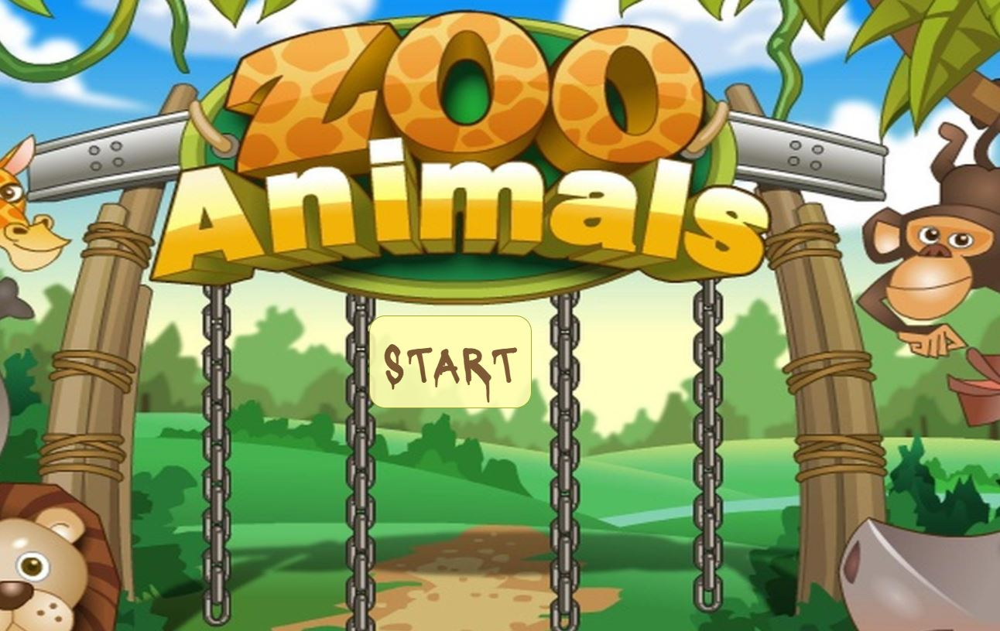

# Word-Guess-Game

Word Guess Game: In this game the user will try to guess the name of the animal zoo by typing the letters spell it's name.
If the user guess the name right, his score will increase by one and each time he miss the right letter his attempts will be decreased by one till the game is over.

Steps:

1. the first screen is start button to start the game.
   
