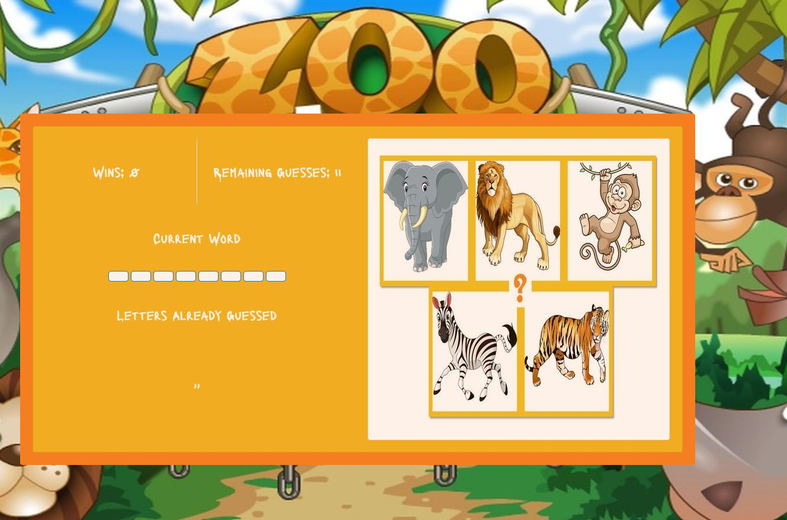

# Word-Guess-Game
#link: https://hishamss.github.io/Word-Guess-Game/

Word Guess Game: In this game the user will try to guess the name of the animal zoo by typing the letters spell it's name.
If the user guess the name right, his score will increase by one and each time he miss the right letter his attempts will be decreased by one till the game is over.

Steps:

1. the first screen is start button to start the game and the uesr hears jungle background sound during the game.
   

2. After clicking on start button, the following message will be displayed on the screen for 2.5 sec
   

3. Then the user start guessing the name of one of the animals shown to the right of the guessing area, as shown below
   

4. Every time the user guess the word it will display the animal picture and play the animal voice for 3 sec then switch back to guess pic.

5. If the user uses all his attempts, he will get Game Over Message and sound effect and the jungle sound will stop play. the user can click Play Again button to start over.
   
